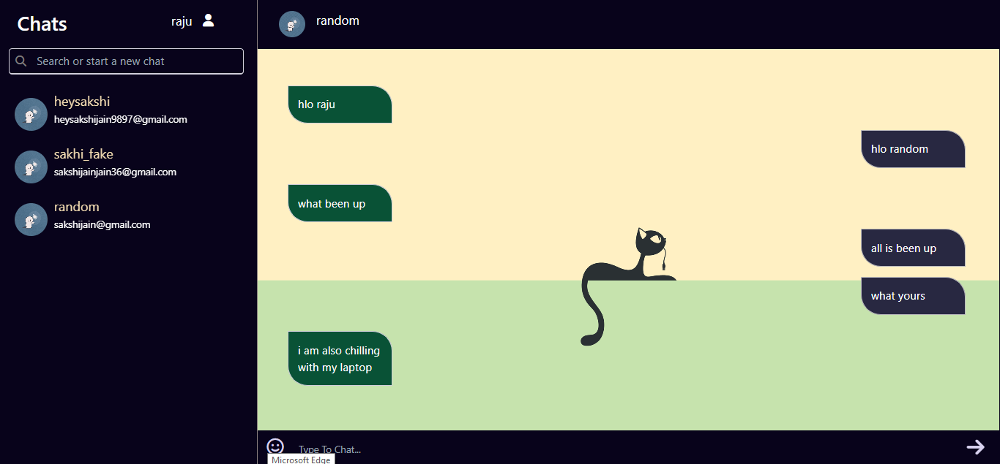

📋 Description

A real-time chat application that allows users to communicate with each other in private or group chat rooms. Built with modern web technologies, the application ensures a seamless and interactive user experience with instant message delivery and dynamic updates.

Images:

🚀 Features

- Real-time Messaging: Send and receive messages instantly.
- User Authentication: Secure sign-up and login with encryption.
- Responsive Design: Fully responsive UI for desktop and mobile devices.
- Message Notifications: Get notified of new messages in real-time.
- Message History: Access previous conversations with persistent storage.

🛠️ Tech Stack

- Frontend: HTML, CSS, JavaScript, React.js
- Backend: Node.js, Express.js
- Database: MongoDB
- Real-time Communication: Socket.IO
- Authentication: JWT (JSON Web Tokens)
- Styling: Tailwind CSS / Bootstrap
- Deployment: Vercel

Contributor:
designed by :https://github.com/sakshixjain
devloped by :https://github.com/rajeevchaudhary-x/

